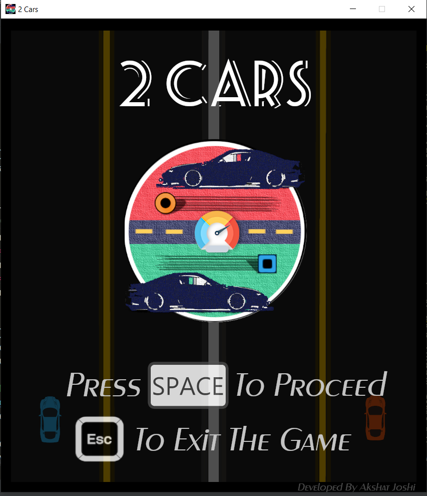
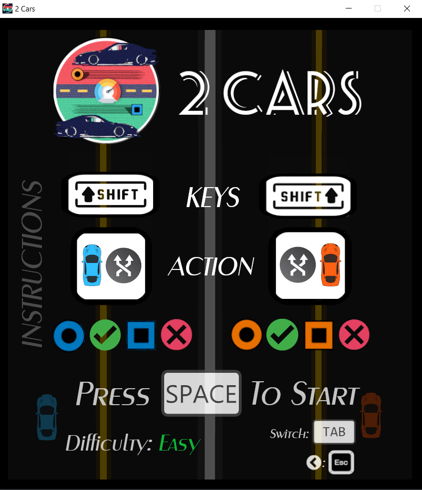
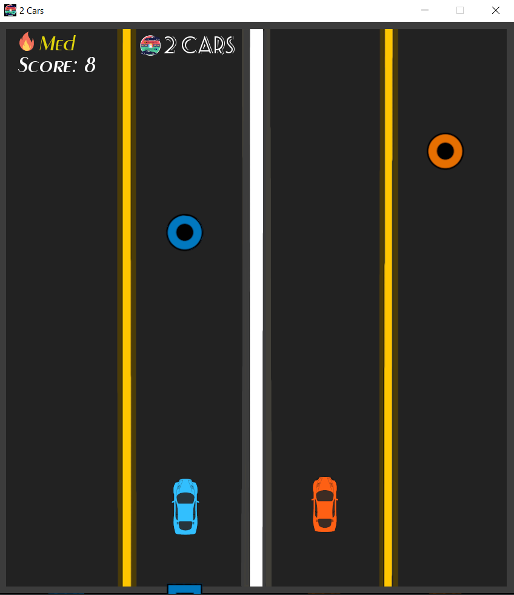
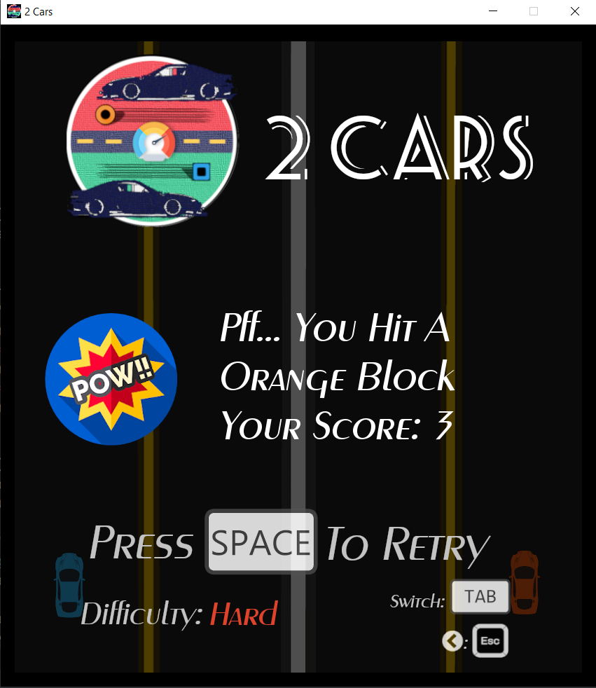

# 2Cars
 An arcade game, played by many across the globe, intended to improve one's reception, control and reflexes. Can be taken as a challenge. A simple working but its interesting quirks, makes it a fun game to play.

<B> Glimpse: </B>

 &nbsp; &nbsp; 
  
 &nbsp; &nbsp; 

<B> Development Info: </B>

The game has been developed in Python 3.7 using PyGame & other libraries.

    • PyGame 
Pygame is a cross-platform set of Python modules designed for writing video games with the Python language. Pygame was originally written by Pete Shinners to replace PySDL after its development stalled. It has been a community project since 2000. It is a wrapper for the SDL library, which stands for Simple DirectMedia Layer. SDL provides cross-platform access to the system’s underlying multimedia hardware components, such as sound, video, mouse, keyboard, and joystick. 

    • Random
This module implements pseudo-random number generators for various distributions. It is useful in generating random numbers for use in a program. random() is the most basic function of the random module. Almost all functions of the random module depend on this function. random() returns the next random floating-point number in the range [0.0, 1.0). More useful functions like randint(), randrange(), choice(), etc are availaible in this library.

    • Math
This module provides access to the mathematical functions defined by the C standard. It provides access to some common math functions and constants in Python, which can be used throughout our code for more complex mathematical computations. Some functions include sqrt(), pow(), exp(), log().